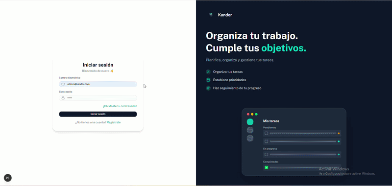
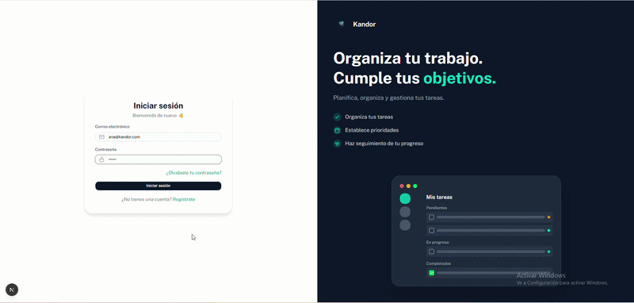
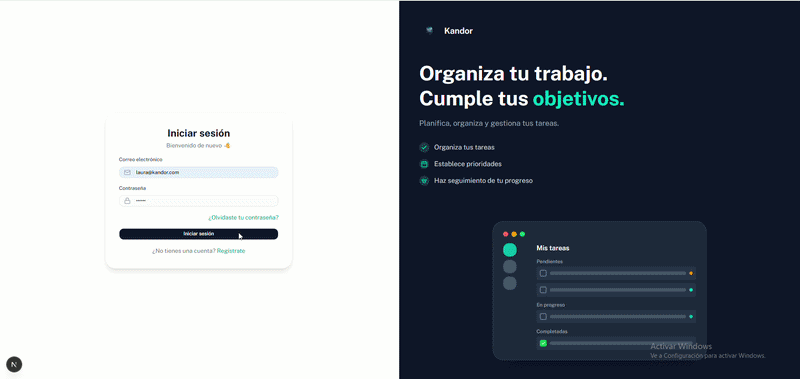
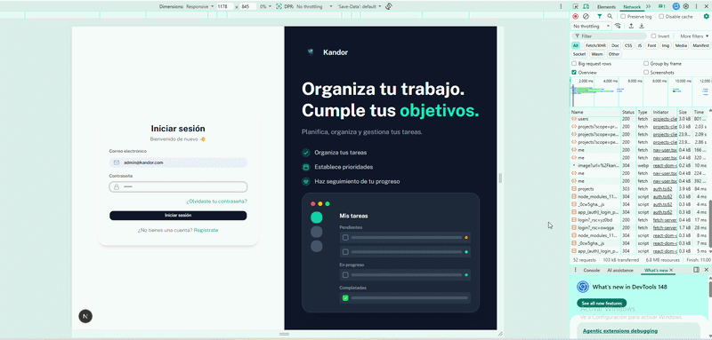

# Kandor

Sistema de gestión de tareas tipo Kanban con roles, dashboard analítico y notificaciones en tiempo real.

## Demo

| Rol          | Correo             | Contraseña |
| ------------ | ------------------ | ---------- |
| Administrador | `admin@kandor.com` | `123456`   |
| Líder de equipo | `laura@kandor.com` | `123456`   |
| Miembro      | `ana@kandor.com`   | `123456`   |

> Hay 9 usuarios en total (1 admin, 3 líderes, 5 miembros). Todos con contraseña `123456`.

## Despliegue

🔗 **`https://nombreEquipo-Funcionalidad.vercel.app`** (pendiente de crear)

## Funcionalidades

- **Autenticación** — registro e inicio de sesión con sesiones seguras (cookies encryptadas)
- **Roles** — `ADMIN`, `TEAM_LEADER`, `MEMBER` con vistas y permisos diferenciados
- **Tablero Kanban** — arrastrar y soltar tareas entre estados (Backlog → Por Hacer → En Progreso → Revisión → Completado)
- **Dashboard** — gráficos Burnup (completadas acumuladas vs total) y CFD (distribución por estado), filtrados por rol
- **Proyectos** — CRUD de proyectos, membresías, solicitudes de liderazgo, solicitudes de salida
- **Notificaciones** — badges en la barra lateral con polling cada 15s (propuestas y salidas para admin, solicitudes para líderes)
- **Responsivo** — diseño adaptable a móvil con sidebar offcanvas

## Stack

| Capa        | Tecnología                         |
| ----------- | ---------------------------------- |
| Framework   | Next.js 16 (App Router)            |
| Base de datos | PostgreSQL + Prisma ORM          |
| UI          | shadcn/ui + Tailwind CSS           |
| Gráficos    | Recharts                           |
| Autenticación | bcryptjs + cookies encryptadas |
| Drag & drop | @dnd-kit                           |

## Conceptos del sistema

- **Maestros** — se refiere a los **usuarios del sistema** (personas que pueden iniciar sesión, tener roles y ser asignadas a tareas y proyectos).
- **Transacciones** — se refiere a las **acciones registradas por los usuarios** (crear, mover o completar tareas), almacenadas en el historial de auditoría (`AuditLog`).

## Capturas

### 1. Administración de usuarios (Maestros)

Vista de administración donde se gestionan los **usuarios del sistema (maestros)**: creación, edición de roles y listado de todos los usuarios registrados.

### 2. Tablero Kanban

Flujo completo del tablero Kanban: creación de tareas, arrastrar y soltar entre estados (Backlog → Por Hacer → En Progreso → Revisión → Completado).

### 3. Historial de transacciones

Registro de **transacciones (auditoría)**: cada acción realizada por los usuarios queda almacenada con fecha, usuario, tipo de acción y detalle del cambio.

### 4. Responsividad

La aplicación se adapta a dispositivos móviles con sidebar offcanvas, layout apilado y navegación táctil.
